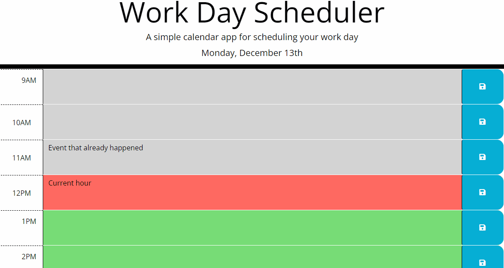

# Not So Simple Work Day Scheduler
An application  using jQuery, day.JS,  and Local Storage to create a "simple work day" scheduler. How it supposed to work is when user inputs data into text area and hit save the date will get uploaded into local storage so, when the webpage is refreshed the information stays that was was inputed by said user. Time blocks should have changed color depending on current day.

## Deployed Application
link:   https://carrtealexander.github.io/NotSoSimpleCalendar/

## Mockup

## Image for Deployed Application

## Installation
Day.JS

VS Code

node.js

jqueryUI

Bootstrap

HTML

CSS

Javascript

window.localStorage

jquery

bootstrap

## Usage
Visit the link above to view the scheduler. Input events in the text areas and click the Save button to save the events.

## Credits
GitHub

## License
None

